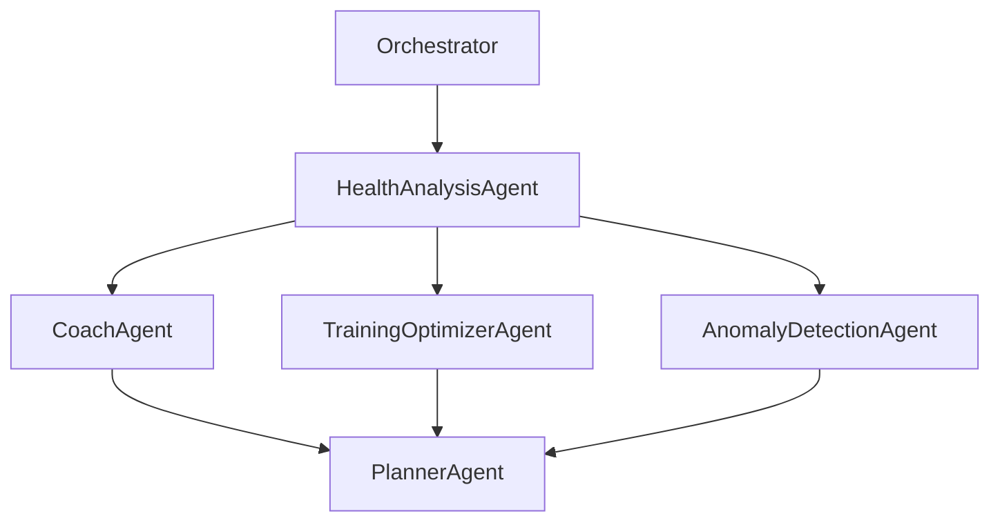

# Multi-Agent Health Platform

This document defines the agent roster, responsibilities, interfaces, tools, and prompt designs used by the platform.

## Orchestration Diagram



## Shared Agent Interfaces

**AgentInput**
- `user_id` (string)
- `timestamp` (datetime)
- `metrics` (heart_rate, hrv, sleep_hours, resting_heart_rate)
- `baselines` (optional)
- `recent_insights` (optional list of strings)
- `goals` (optional list of strings)

**AgentOutput**
- `summary` (string)
- `recommendations` (list of strings)
- `actions` (list of strings)
- `confidence` (float 0-1)
- `citations` (list of strings)

## Agents

### HealthAnalysisAgent
**Purpose**: Compute recovery signals, baseline deltas, and summarize the current health state.  
**Tools**: `get_baselines`, `compute_recovery`, `baseline_delta_calc`, `search_memory`  
**Memory**: writes daily summary to long-term memory  

**Prompt Template**
```
You are a health analyst. Summarize the user's recovery state using metrics and baselines.
Return a concise summary and 2-3 practical recommendations.
```

---

### CoachAgent
**Purpose**: Generate daily coaching guidance and behavior changes.  
**Tools**: `summarize_trends`, `generate_coaching_summary`, `search_memory`  
**Memory**: reads last 7-day summaries  

**Prompt Template**
```
You are a supportive health coach. Provide actionable, empathetic guidance
based on recent trends. Avoid medical advice.
```

---

### TrainingOptimizerAgent
**Purpose**: Optimize training load and suggest intensity targets.  
**Tools**: `training_reco`, `readiness_score`, `get_recent_metrics`  
**Memory**: reads 14-day training history  

**Prompt Template**
```
You are a training optimization agent. Recommend today's training intensity
and volume based on readiness and recent load.
```

---

### AnomalyDetectionAgent
**Purpose**: Detect abnormal HR/HRV/sleep patterns and trigger alerts.  
**Tools**: `anomaly_scan`, `create_alert`, `search_memory`  
**Memory**: reads baseline history  

**Prompt Template**
```
You are an anomaly detection agent. Identify abnormal patterns and explain
why they might matter. Be conservative and avoid alarmist language.
```

---

### PlannerAgent
**Purpose**: Stitch outputs into a final user-facing insight.  
**Tools**: `write_memory`  
**Memory**: uses outputs from other agents and stores final summary  

**Prompt Template**
```
You are the planning agent. Combine all agent outputs into a single,
clear insight with top recommendations. Keep it short and actionable.
```

## Workflows

### Daily Health Check
1. Fetch recent metrics and baselines.
2. Compute recovery and deltas.
3. Generate coaching insights.
4. Store summary memory.
5. Return UI payload.

### Training Recommendation Loop
1. Analyze last 7 days of metrics.
2. Identify readiness.
3. Recommend intensity and volume.
4. Log reasoning trace.

### Anomaly Alerts
1. Compare current vs baseline.
2. Flag anomalies.
3. Trigger alert and coaching safety message.
